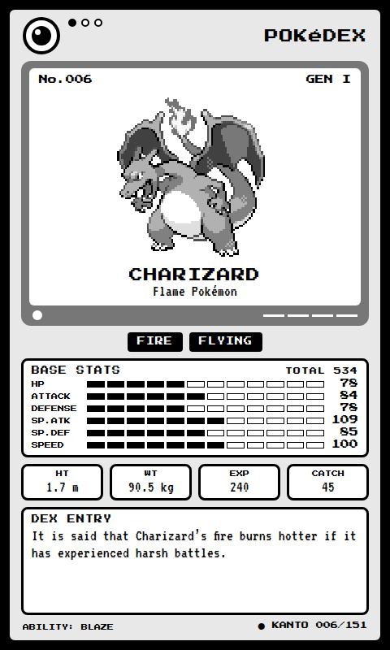
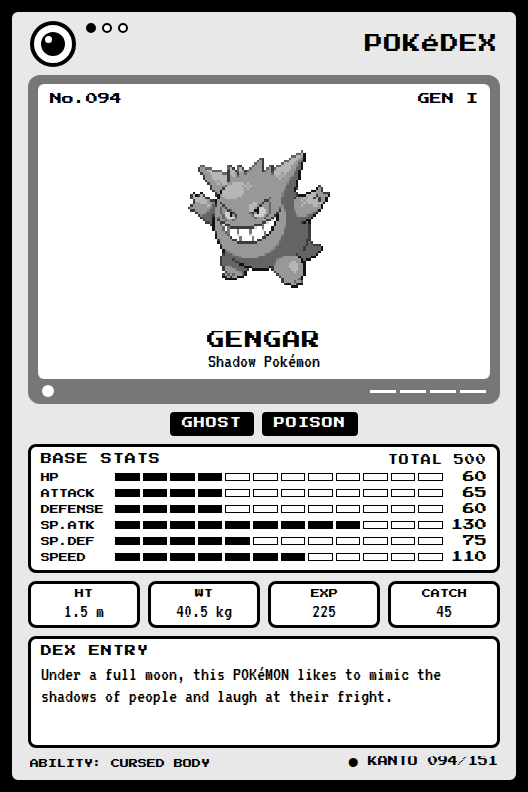
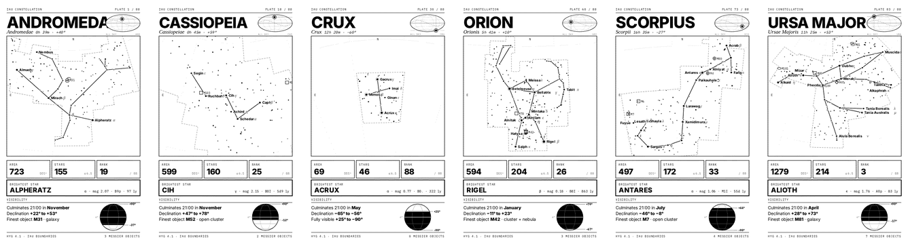
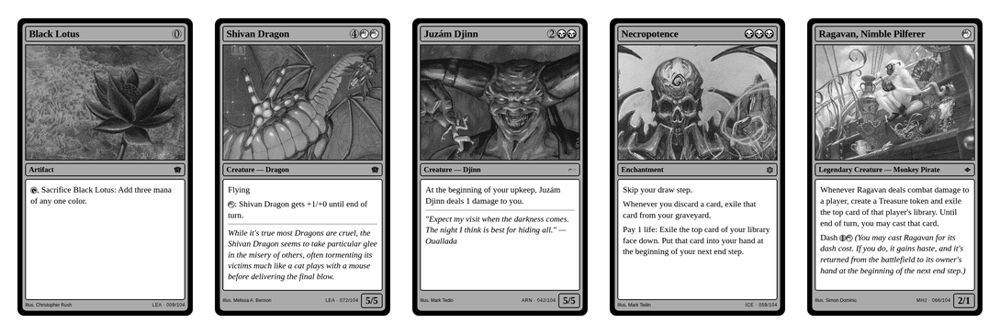

# xteink-screens

Sleep-screen wallpapers for the **Xteink X3** and **Xteink X4** e-readers, pre-dithered for
CrossPoint / CrossInk firmware so grayscale shading renders correctly on the panel instead of
blowing out to white.

## What's here

| Folder | Contents |
| --- | --- |
| [`Pokédex/x4`](Pokédex/x4) | All 151 original Kanto Pokémon as 480×800 data-sheet screens for the X4 |
| [`Pokédex/x3`](Pokédex/x3) | The same 151 screens at 528×792 for the X3 |
| [`Constellations/x4`](Constellations/x4) | All 88 IAU constellations as 480×800 star-chart plates for the X4 |
| [`Constellations/x3`](Constellations/x3) | The same 88 plates at 528×792 for the X3 |
| [`Magic/x4`](Magic/x4) | 104 iconic Magic: The Gathering cards as 480×800 card facsimiles for the X4 |
| [`Magic/x3`](Magic/x3) | The same 104 cards at 528×792 for the X3 |

  
  

  

  

> Why pre-dithered? CrossInk/CrossPoint maps a BMP whose palette is exactly the four native
> gray levels (`#000/#555/#AAA/#FFF`) **1:1 to panel states** — no re-quantization, no dithering
> (`Bitmap.cpp` nativePalette path). Plain grayscale BMPs instead get hard-thresholded at
> 45/70/140 with no error diffusion, which blows highlights out to white. These files carry the
> dither baked in, so what you author is what the panel shows.

## Downloading a folder as a zip

GitHub can't zip a single folder from the web UI, so either:

1. **Releases (easiest):** grab `pokedex-x4.zip` / `pokedex-x3.zip`,
   `constellations-x4.zip` / `constellations-x3.zip`, or
   `magic-x4.zip` / `magic-x3.zip` from the
   [releases page](../../releases) — these are pre-zipped copies of each folder.
2. **download-directory:** paste a folder URL into <https://download-directory.github.io>, or use
   these direct links:
   - [Download Pokédex/x4 as zip](https://download-directory.github.io/?url=https%3A%2F%2Fgithub.com%2Fdmellok%2Fxteink-screens%2Ftree%2Fmain%2FPok%C3%A9dex%2Fx4)
   - [Download Pokédex/x3 as zip](https://download-directory.github.io/?url=https%3A%2F%2Fgithub.com%2Fdmellok%2Fxteink-screens%2Ftree%2Fmain%2FPok%C3%A9dex%2Fx3)
   - [Download Constellations/x4 as zip](https://download-directory.github.io/?url=https%3A%2F%2Fgithub.com%2Fdmellok%2Fxteink-screens%2Ftree%2Fmain%2FConstellations%2Fx4)
   - [Download Constellations/x3 as zip](https://download-directory.github.io/?url=https%3A%2F%2Fgithub.com%2Fdmellok%2Fxteink-screens%2Ftree%2Fmain%2FConstellations%2Fx3)
   - [Download Magic/x4 as zip](https://download-directory.github.io/?url=https%3A%2F%2Fgithub.com%2Fdmellok%2Fxteink-screens%2Ftree%2Fmain%2FMagic%2Fx4)
   - [Download Magic/x3 as zip](https://download-directory.github.io/?url=https%3A%2F%2Fgithub.com%2Fdmellok%2Fxteink-screens%2Ftree%2Fmain%2FMagic%2Fx3)
3. **Whole repo:** Code → Download ZIP (includes both folders).

## Installing on the device

1. Copy the `.bmp` files you want onto the device (USB mass storage).
2. On the device, open a file in **Browse Files** — the built-in BMP viewer displays it.
3. Choose **set as sleep screen cover** from the viewer.

Files are 4-bit indexed BMPs (four-gray palette, top-down rows) — the exact layout the stock
BMP loader expects; no further conversion needed.

## Test cards

[`test-cards/`](test-cards) holds diagnostic BMPs for verifying the firmware's 4-level grayscale
sleep-screen pipeline: the top half is four solid vertical bands, one per native gray level
(palette-native 4-bit files, so the firmware maps them 1:1 with no dithering). A healthy unit
shows four distinct bands; if the two middle bands render black (or the panel wipes to white),
the multi-pass grayscale refresh is not running correctly — see
[crosspoint-reader#2879](https://github.com/crosspoint-reader/crosspoint-reader/issues/2879).

## Format details

- X4: 480×800 · X3: 528×792, both portrait
- 4 bpp indexed, palette `#000000 #555555 #AAAAAA #FFFFFF`, `biClrUsed=4`, negative-height (top-down) `BITMAPINFOHEADER`
- Floyd–Steinberg error diffusion against the **nominal** levels 0/85/170/255 (thresholds
  43/128/213). Because the palette is native, the firmware maps each index straight to a panel
  state and its gray composite renders the two middle states at their proper visible levels —
  so no midtone pre-brightening is wanted. (An earlier revision of this file described
  pre-compensated levels 10/49/111/225; that approach blew out highlights and was dropped in
  331b60b, but the note was left behind. The committed BMPs have always used the nominal ramp.)
- Rendered from live [Tesserae](https://github.com/dmellok) canvases

### Sources

- **Pokédex** — [PokéAPI](https://pokeapi.co): sprites, base stats, dex entries and habitats are
  the real Gen-I data set. Pokémon and Pokémon character names are trademarks of Nintendo; this is
  a fan-made, non-commercial project.
- **Constellations** — stars from the [HYG database](https://github.com/astronexus/HYG-Database)
  v4.1 (CC BY-SA) filtered to magnitude ≤6.5, Messier objects from its deep-sky companion
  catalogue, and stick figures plus IAU boundaries from
  [d3-celestial](https://github.com/ofrohn/d3-celestial) (BSD-3). Areas, culmination months and
  visibility limits are computed from that geometry, not copied — the spherical-polygon areas
  agree with the published IAU values (Orion 594.1, Crux 68.5, Hydra 1302.5 deg²).
- **Magic** — card data, art crops, set symbols and mana symbols from the
  [Scryfall API](https://scryfall.com/docs/api) (card data is CC0; card images and artwork remain
  © Wizards of the Coast and their respective artists). Each card is pinned to a specific
  printing so the original art is used — Christopher Rush's Black Lotus rather than a modern
  reprint. Every plate credits its illustrator. Magic: The Gathering is a trademark of Wizards of
  the Coast LLC; this is a fan-made, non-commercial project and is not affiliated with or
  endorsed by Wizards of the Coast or Scryfall.

### What's on a Magic plate

A facsimile of the card itself, proportioned for the panel: title bar with mana cost, art window,
type line with the set symbol, rules text box with reminder text italicised, and the illustrator
credit, set code and plate number along the bottom. Power/toughness or starting loyalty sits in
the corner box where the real card puts it.

Colour identity is carried by the **shape** of each mana symbol rather than its tone — five
colours don't fit into four grey levels, so the flame, droplet, skull, sun and tree glyphs do the
distinguishing, with the disc behind them shaded only light-to-dark. Rules text is auto-fitted per
card, since a Black Lotus and an Urza's Saga differ by a factor of sixty in word count.

### What's on a constellation plate

Stereographic projection centred on the constellation, north up and east left. Stars are sized by
magnitude; Messier objects use the conventional symbols. The oval top-right is an all-sky Hammer
projection locating the constellation against the celestial equator (solid) and the ecliptic
(dashed). The globe bottom-right shades the band of Earth latitudes from which the entire figure
clears the horizon at some point in the year — nothing on these plates is tied to one observing
site.
