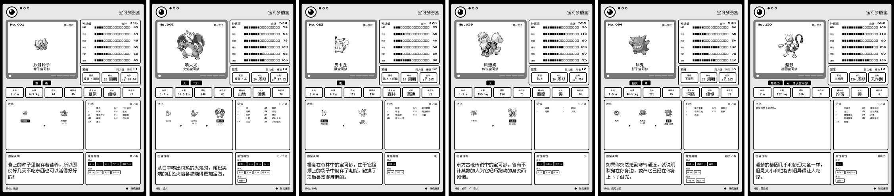
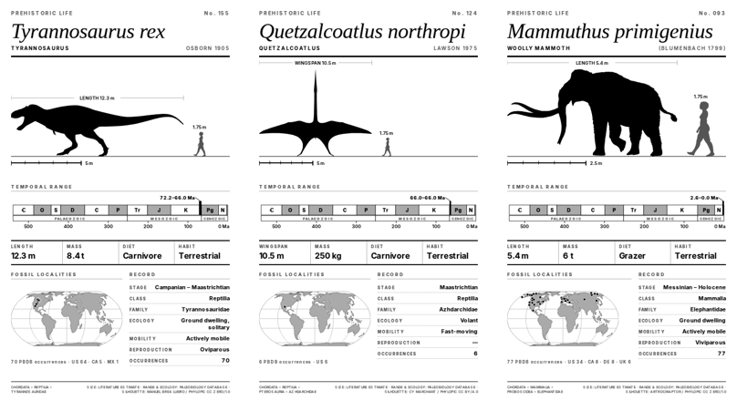

# eink-screens

Sleep-screen wallpapers for e-ink readers, rendered at each panel's native geometry.

## Devices

| Device | Panel | Format |
| --- | --- | --- |
| Xteink X4 | 480×800, 4-level grey | 4-bit BMP, dither baked in |
| Xteink X3 | 528×792, 4-level grey | 4-bit BMP, dither baked in |
| Seeed reTerminal Sticky | 480×800 held upright, 4-level grey | 4-bit BMP or 8-bit greyscale PNG, dither baked in |
| Kindle Paperwhite (11th gen) | 1236×1648, 16-level grey | 8-bit greyscale PNG |
| Kindle Scribe | 1860×2480, 16-level grey | 8-bit greyscale PNG |
| Kindle Oasis / Paperwhite (12th gen) | 1264×1680, 16-level grey | 8-bit greyscale PNG |
| Kindle Paperwhite (1st/2nd gen) | 758×1024, 16-level grey | 8-bit greyscale PNG |
| Kindle Paperwhite (3rd gen) | 1072×1448, 16-level grey | 8-bit greyscale PNG |
| Kindle (basic, 6") and similar | 600×800, 16-level grey | 8-bit greyscale PNG |
| Kobo Libra Colour | 1264×1680, Kaleido 3 colour | **colour** PNG |
| Kobo Clara Colour | 1072×1448, Kaleido 3 colour | **colour** PNG |

The Xteink files are pre-dithered because CrossInk/CrossPoint maps a BMP whose palette is exactly
the four native grey levels (`#000/#555/#AAA/#FFF`) **1:1 to panel states** — no re-quantization,
no dithering (`Bitmap.cpp` nativePalette path). Plain greyscale BMPs instead get hard-thresholded
at 45/70/140 with no error diffusion, which blows highlights out to white. The Kindle files are
*not* pre-dithered: that panel has 16 levels and renders greyscale PNGs perfectly well on its own.

The reTerminal Sticky files are pre-dithered for the same reason as the Xteink ones — four levels
is too few to leave to whatever the firmware does on the way in — and come in both containers,
because the Sticky's reader firmware reads BMP while the dashboard firmwares read PNG. See
[below](#the-reterminal-sticky-shares-the-x4-sheet) for which file to use with which firmware.

## What's here

| Folder | Contents |
| --- | --- |
| [`Pokédex/x4`](Pokédex/x4) | All 151 original Kanto Pokémon as 480×800 data-sheet screens for the X4 |
| [`Pokédex/x3`](Pokédex/x3) | The same 151 screens at 528×792 for the X3 |
| [`Pokédex/reterminal-sticky`](Pokédex/reterminal-sticky) | The same 151 screens as PNG for the reTerminal Sticky held upright (see below) |
| [`Pokédex/kindle-pw`](Pokédex/kindle-pw) | The same 151 at 1236×1648, expanded for the Paperwhite (see below) |
| [`Pokédex/kindle-scribe`](Pokédex/kindle-scribe) | The same 151 at 1860×2480, expanded again for the Scribe (see below) |
| [`Pokédex/kindle-oasis-pw12`](Pokédex/kindle-oasis-pw12) | The same expanded layout at 1264×1680 (Oasis, 12th-gen Paperwhite) |
| [`Pokédex/kindle-pw2`](Pokédex/kindle-pw2) | The same expanded layout at 758×1024 (1st/2nd-gen Paperwhite) |
| [`Pokédex/kobo-libra-colour`](Pokédex/kobo-libra-colour) | 1264×1680 **in colour**, red Pokédex shell, for the Kobo Libra Colour |
| [`Pokédex/kobo-clara-colour`](Pokédex/kobo-clara-colour) | The same colour sheet at 1072×1448 for the Kobo Clara Colour |
| [`Pokédex/kindle-pw3-zh`](Pokédex/kindle-pw3-zh) | 1072×1448 **in Simplified Chinese** for the 3rd-gen Paperwhite (see below) |
| [`Pokédex/kindle-6in`](Pokédex/kindle-6in) | 600×800, reduced layout for small 6" panels (see below) |
| [`Constellations/x4`](Constellations/x4) | All 88 IAU constellations as 480×800 star-chart plates for the X4 |
| [`Constellations/x3`](Constellations/x3) | The same 88 plates at 528×792 for the X3 |
| [`Magic/x4`](Magic/x4) | 104 iconic Magic: The Gathering cards as 480×800 card facsimiles for the X4 |
| [`Magic/x3`](Magic/x3) | The same 104 cards at 528×792 for the X3 |
| [`SCP/x4`](SCP/x4) | Top 100 SCP Foundation articles as 480×800 file plates for the X4 |
| [`SCP/x3`](SCP/x3) | The same 100 plates at 528×792 for the X3 |
| [`Prehistoric/x4`](Prehistoric/x4) | 164 extinct animals as 480×800 natural-history plates for the X4 |
| [`Prehistoric/x3`](Prehistoric/x3) | The same 164 plates at 528×792 for the X3 |

  
  

  

  

  

  

  

  

  

### The reTerminal Sticky shares the X4 sheet

The Sticky's 3.97" panel is wired as 800×480, but the thing is made to be stood upright on a desk
or stuck to a fridge, and upright it is **480×800 with four grey levels** — the X4's geometry and
the X4's palette exactly. So this is not a new layout: `reterminal-sticky` is the X4 sheet, the
same 151 plates, pixel for pixel. Only the container changes.

Which file you want depends on the firmware, and the Sticky runs several. Because the plates are
the X4's, both formats already exist and neither needs converting:

- **Crosspoint, or any firmware that reads BMP** — take the 4-bit BMPs, either from the
  [`pokedex-reterminal-sticky.zip`](../../releases/tag/pokedex-v2.0) release asset or from
  [`Pokédex/x4`](Pokédex/x4) in the tree, which holds the identical files. Crosspoint is the same
  firmware family as the Xteink readers, so a palette-native BMP hits the 1:1 path described
  above; a PNG would only be re-quantized on the way in.
- **TRMNL, ESPHome, OpenDisplay, or the stock Seeedash photo upload** — use the PNGs in
  [`Pokédex/reterminal-sticky`](Pokédex/reterminal-sticky). These are dashboard firmwares that
  fetch or are handed an image; PNG is what they read.

The release zip carries the BMPs rather than the PNGs, since BMP is what the Sticky's reader
firmware wants and the tree already serves the PNGs a click away. The BMPs are not committed a
second time under `reterminal-sticky/` because they would be byte-for-byte copies of `x4/`.

Both sets are already error-diffused to the four native levels (0/85/170/255), so nothing here
needs a second dither. If your firmware paints the native landscape buffer without rotating for
you, rotate the plate 90° on the way in rather than re-rendering it — the dither survives a
rotation, but not a rescale.

> Built to the published 800×480 / 4-level spec and not yet confirmed on hardware.

### The Paperwhite Pokédex is a different layout

It is not the X3/X4 sheet upscaled. The Paperwhite has roughly 5× the pixels, so the extra room
carries extra data rather than larger type — the type is scaled about 2×, not 2.6×, because at
300 ppi a straight pixel-for-pixel scale would leave the glyphs physically enormous. Added over
the Xteink version: the evolution chain with sprites and conditions, the Red/Blue level-up
learnset, breeding data (egg groups, hatch cycles, gender ratio, EV yield), habitat, growth rate,
base friendship, and a computed type-matchup panel.

That matchup panel uses the **Generation I** type chart, not the modern one, to match the Kanto
roster and the Red/Blue learnset beside it. It is derived from PokéAPI's `past_damage_relations`
rather than transcribed, so Ghost deals 0 to Psychic, and Bug and Poison hit each other for 2×.

The same expanded layout is also rendered at 1264×1680 and 758×1024. **600×800 is different**:
that panel is too small to carry the dense panels legibly, so `kindle-6in` uses the compact
layout from the Xteink sets instead. It keeps the sprite, base stats, height/weight/experience/
catch rate and the dex entry, and drops the learnset, type matchup, breeding block and evolution
chain. Everything on it is readable at 167 ppi, which the shrunken full layout was not.

### The Scribe goes one step further again

`kindle-scribe` stands in the same relation to the Paperwhite sheet that the Paperwhite does to
the Xteink one. Both panels are 300 ppi, so scaling the 1236×1648 layout up to 1860×2480 would
not sharpen anything — it would just make every glyph physically 1.5× larger. Instead the type
sizes, borders and sprite dimensions are carried over **unchanged**, and the surplus 624×832 px
holds new panels:

- **Field illustration** — the official artwork, which the Paperwhite sheet has no room for and
  never uses, beside the pixel sprite rather than replacing it.
- **Attacking matchup** — the same Generation I chart read in the other direction. The Paperwhite
  only scores the Pokémon defensively; this adds what its own types do to each defender, taking
  the better of the two for a dual-type (i.e. the STAB move you would actually reach for).
- **The complete Red/Blue learnset** — the Paperwhite sheet caps the list at ten moves for space.
- **Scale** — height against a 1.7 m trainer, which is how you find out Onix is 8.8 m.

The matchup row is sized off Onix, which carries more chips than any other Kanto species (five
weaknesses, five resistances and an immunity), so nothing overflows anywhere else.

### The Kobo sets are in colour

`kobo-libra-colour` and `kobo-clara-colour` are the colour sets here. Kaleido 3 renders colour at
150 ppi but black and white at the full 300 ppi, and desaturates noticeably, so colour is used on
large blocks — the red Pokédex shell, type badges in their official type colours, stat bars in
the primary type colour, and matchup chips coded red for weaknesses, green for resistances and
grey for immunity. Body text stays black on white, where the panel keeps it crisp. Sprites are
full colour rather than the greyscale treatment the mono sets use.

The Clara Colour is the same sheet at 1072×1448 — a 6" Kaleido 3 panel rather than the Libra's
7", so it is the same design scaled down rather than a different layout.

### One set is in Chinese

`kindle-pw3-zh` is the Paperwhite sheet in Simplified Chinese, at 1072×1448 for the 3rd-gen
Paperwhite. The Chinese is the **official** localisation, not a translation of the English sheet:
species names, categories and dex entries come from PokéAPI's own `zh-Hans` entries, so 妙蛙种子
is what Nintendo calls Bulbasaur and the dex text is the line from the games. Type names, move
names, abilities and egg groups come from the same place. Only the nine habitats and the four
growth rates have no Chinese in PokéAPI and are mapped by hand.

Two things are set differently from the Latin sheets:

- **The type is larger.** A Han character needs roughly twice the em of a capital to stay legible,
  but a Chinese label is two to four characters where the English was two or three words, so it
  fits in the same boxes — 13px `HABITAT` becomes 16px 栖息地. The dex-entry row is the elastic one
  on the English sheet, so the two rows above it are pinned here and the bottom row gets the same
  space whatever the species; the sprite gives up 40px to pay for it.
- **The font ships with the plate.** The renderer only has Latin faces, so the sheet carries
  [Fusion Pixel 12px](https://github.com/TakWolf/fusion-pixel-font) (OFL) inline, subsetted to the
  ~1,200 characters the 151 plates use. It is a bitmap design on the same 12px grid as the Latin
  pixel fonts beside it, so the two read as one typeface rather than a pixel font next to a
  smoothed one.

### The Prehistoric plates are assembled from live data

Each of the 164 plates is one extinct animal, and almost everything on it is fetched rather than
written. Age range, stage, taxonomy, diet, ecology and the fossil localities all come from the
[Paleobiology Database](https://paleobiodb.org); the silhouette comes from
[PhyloPic](https://www.phylopic.org); the coastlines are Natural Earth on an Equal Earth
projection. Only body size is hand-compiled — PBDB does not carry it and Wikidata's coverage of
extinct taxa is close to empty — so those figures are typical adult literature estimates and the
plate says so.

Two things are worth knowing about how to read them:

- **The human is at true scale.** The grey figure is 1.75 m, drawn at the same px-per-metre as the
  animal beside it, so the comparison is arithmetic rather than artistic. Where the animal is small
  enough that a to-scale human would not fit on the plate, the human is dropped and the scale bar
  says `human omitted` — it is never silently rescaled.
- **The quoted dimension matches the pose.** Sauropods and mosasaurs are drawn in side view and
  scaled to body length; pterosaurs are drawn wings-out and scaled to wingspan; bipeds like
  *Gastornis* and the terror bird are scaled to standing height, with the dimension bar turned
  vertical. The silhouette is picked per taxon to match — for wingspan the widest available pose,
  for height the most upright.

The dots on the map are individual PBDB collections at **modern** coordinates, not
palaeocoordinates: they show where the fossils were dug up, not where the animal lived on the
continents of its own day. *Mammuthus primigenius* has 77 of them across Eurasia and North America;
*Argentinosaurus* has one.

Where PhyloPic had no silhouette for the species or its genus, a higher-taxon one stands in and
[`ATTRIBUTION.md`](Prehistoric/ATTRIBUTION.md) marks which — those eight plates illustrate the
group rather than the species. That file also carries the per-plate artist and licence, which
vary: mostly CC0 and CC BY, with five plates whose only available silhouette is NonCommercial.

## Downloading a folder as a zip

GitHub can't zip a single folder from the web UI, so either:

1. **Releases (easiest):** every set is pre-zipped on the [releases page](../../releases).
   The Pokédex lives in one place, [Pokédex v2.0](../../releases/tag/pokedex-v2.0), with a zip
   per panel size; the other sets have a release each
   (`constellations-*`, `magic-*`, `scp-*`, `prehistoric-*`).
2. **download-directory:** paste a folder URL into <https://download-directory.github.io>, or use
   these direct links:
   - [Download Pokédex/x4 as zip](https://download-directory.github.io/?url=https%3A%2F%2Fgithub.com%2Fdmellok%2Feink-screens%2Ftree%2Fmain%2FPok%C3%A9dex%2Fx4)
   - [Download Pokédex/x3 as zip](https://download-directory.github.io/?url=https%3A%2F%2Fgithub.com%2Fdmellok%2Feink-screens%2Ftree%2Fmain%2FPok%C3%A9dex%2Fx3)
   - [Download Pokédex/reterminal-sticky as zip](https://download-directory.github.io/?url=https%3A%2F%2Fgithub.com%2Fdmellok%2Feink-screens%2Ftree%2Fmain%2FPok%C3%A9dex%2Freterminal-sticky)
   - [Download Pokédex/kindle-pw as zip](https://download-directory.github.io/?url=https%3A%2F%2Fgithub.com%2Fdmellok%2Feink-screens%2Ftree%2Fmain%2FPok%C3%A9dex%2Fkindle-pw)
   - [Download Pokédex/kindle-scribe as zip](https://download-directory.github.io/?url=https%3A%2F%2Fgithub.com%2Fdmellok%2Feink-screens%2Ftree%2Fmain%2FPok%C3%A9dex%2Fkindle-scribe)
   - [Download Pokédex/kindle-oasis-pw12 as zip](https://download-directory.github.io/?url=https%3A%2F%2Fgithub.com%2Fdmellok%2Feink-screens%2Ftree%2Fmain%2FPok%C3%A9dex%2Fkindle-oasis-pw12)
   - [Download Pokédex/kindle-pw2 as zip](https://download-directory.github.io/?url=https%3A%2F%2Fgithub.com%2Fdmellok%2Feink-screens%2Ftree%2Fmain%2FPok%C3%A9dex%2Fkindle-pw2)
   - [Download Pokédex/kindle-6in as zip](https://download-directory.github.io/?url=https%3A%2F%2Fgithub.com%2Fdmellok%2Feink-screens%2Ftree%2Fmain%2FPok%C3%A9dex%2Fkindle-6in)
   - [Download Pokédex/kobo-libra-colour as zip](https://download-directory.github.io/?url=https%3A%2F%2Fgithub.com%2Fdmellok%2Feink-screens%2Ftree%2Fmain%2FPok%C3%A9dex%2Fkobo-libra-colour)
   - [Download Pokédex/kobo-clara-colour as zip](https://download-directory.github.io/?url=https%3A%2F%2Fgithub.com%2Fdmellok%2Feink-screens%2Ftree%2Fmain%2FPok%C3%A9dex%2Fkobo-clara-colour)
   - [Download Pokédex/kindle-pw3-zh as zip](https://download-directory.github.io/?url=https%3A%2F%2Fgithub.com%2Fdmellok%2Feink-screens%2Ftree%2Fmain%2FPok%C3%A9dex%2Fkindle-pw3-zh)
   - [Download Constellations/x4 as zip](https://download-directory.github.io/?url=https%3A%2F%2Fgithub.com%2Fdmellok%2Feink-screens%2Ftree%2Fmain%2FConstellations%2Fx4)
   - [Download Constellations/x3 as zip](https://download-directory.github.io/?url=https%3A%2F%2Fgithub.com%2Fdmellok%2Feink-screens%2Ftree%2Fmain%2FConstellations%2Fx3)
   - [Download Magic/x4 as zip](https://download-directory.github.io/?url=https%3A%2F%2Fgithub.com%2Fdmellok%2Feink-screens%2Ftree%2Fmain%2FMagic%2Fx4)
   - [Download Magic/x3 as zip](https://download-directory.github.io/?url=https%3A%2F%2Fgithub.com%2Fdmellok%2Feink-screens%2Ftree%2Fmain%2FMagic%2Fx3)
   - [Download SCP/x4 as zip](https://download-directory.github.io/?url=https%3A%2F%2Fgithub.com%2Fdmellok%2Feink-screens%2Ftree%2Fmain%2FSCP%2Fx4)
   - [Download SCP/x3 as zip](https://download-directory.github.io/?url=https%3A%2F%2Fgithub.com%2Fdmellok%2Feink-screens%2Ftree%2Fmain%2FSCP%2Fx3)
   - [Download Prehistoric/x4 as zip](https://download-directory.github.io/?url=https%3A%2F%2Fgithub.com%2Fdmellok%2Feink-screens%2Ftree%2Fmain%2FPrehistoric%2Fx4)
   - [Download Prehistoric/x3 as zip](https://download-directory.github.io/?url=https%3A%2F%2Fgithub.com%2Fdmellok%2Feink-screens%2Ftree%2Fmain%2FPrehistoric%2Fx3)
3. **Whole repo:** Code → Download ZIP (includes every folder).

## Installing on the device

### Xteink X3 / X4

1. Copy the `.bmp` files you want onto the device (USB mass storage).
2. On the device, open a file in **Browse Files** — the built-in BMP viewer displays it.
3. Choose **set as sleep screen cover** from the viewer.

Files are 4-bit indexed BMPs (four-gray palette, top-down rows) — the exact layout the stock
BMP loader expects; no further conversion needed.

### Seeed reTerminal Sticky

Stand it upright first — the plates are portrait.

- **Crosspoint:** copy the `.bmp` files (from the `pokedex-reterminal-sticky.zip` release asset, or
  from [`Pokédex/x4`](Pokédex/x4), which holds the same files) to the microSD card and set one as
  the sleep-screen cover, exactly as on the Xteink readers above.
- **Stock firmware / Seeedash:** upload a PNG from
  [`Pokédex/reterminal-sticky`](Pokédex/reterminal-sticky) as a photo from the app.
- **TRMNL / ESPHome / OpenDisplay:** serve a PNG from the folder as the image the display polls —
  point it at a random file per refresh and the panel cycles the dex on its own.

### Kindle Paperwhite / Scribe

Replacing the Kindle's sleep screen requires a **jailbroken** device — there is no stock way to
set a custom screensaver. With a jailbreak and a screensaver hack installed, copy the `.png`
files into the hack's screensaver folder.

On a stock Kindle these still work as ordinary images: side-load them into `documents/`, or bind
them into a PDF or CBZ and page through the set. They just won't become the lockscreen.

### KOReader (Kobo, Kindle, and others)

KOReader can show a random image from a folder as its sleep screen, which is the easiest way to
use these. Copy the PNGs to the device, then set **gear icon → Screen → Sleep screen** (called
*Screensaver* on older builds) to show a random image from a folder, and point it at that folder.

## Test cards

[`test-cards/`](test-cards) holds diagnostic BMPs for verifying the firmware's 4-level grayscale
sleep-screen pipeline: the top half is four solid vertical bands, one per native gray level
(palette-native 4-bit files, so the firmware maps them 1:1 with no dithering). A healthy unit
shows four distinct bands; if the two middle bands render black (or the panel wipes to white),
the multi-pass grayscale refresh is not running correctly — see
[crosspoint-reader#2879](https://github.com/crosspoint-reader/crosspoint-reader/issues/2879).

## Format details

### Xteink (BMP)

- X4: 480×800 · X3: 528×792, both portrait
- 4 bpp indexed, palette `#000000 #555555 #AAAAAA #FFFFFF`, `biClrUsed=4`, negative-height (top-down) `BITMAPINFOHEADER`
- Floyd–Steinberg error diffusion against the **nominal** levels 0/85/170/255 (thresholds
  43/128/213). Because the palette is native, the firmware maps each index straight to a panel
  state and its gray composite renders the two middle states at their proper visible levels —
  so no midtone pre-brightening is wanted. (An earlier revision of this file described
  pre-compensated levels 10/49/111/225; that approach blew out highlights and was dropped in
  331b60b, but the note was left behind. The committed BMPs have always used the nominal ramp.)

### Kindle Paperwhite (PNG)

- 1860×2480 (Scribe), 1236×1648 (Paperwhite 11th gen), 1264×1680 (Oasis, Paperwhite 12th gen,
  Kobo Libra Colour), 1072×1448 (Paperwhite 3rd gen, Kobo Clara Colour), 758×1024 (Paperwhite
  1st/2nd gen) and 600×800 (basic 6" panels), all portrait.
- 8-bit greyscale PNG, no dithering applied — these panels have 16 levels and handle greyscale
  themselves. The Kobo Libra Colour and Kobo Clara Colour sets are RGB PNG.

Both are rendered from live [Tesserae](https://github.com/dmellok) canvases.

### Sources

- **Pokédex** — [PokéAPI](https://pokeapi.co): sprites, base stats, dex entries and habitats are
  the real Gen-I data set, and the Chinese set uses its `zh-Hans` names, categories, dex entries,
  moves and abilities. Pokémon and Pokémon character names are trademarks of Nintendo; this is
  a fan-made, non-commercial project. The Chinese plates embed
  [Fusion Pixel 12px](https://github.com/TakWolf/fusion-pixel-font) (OFL 1.1), subsetted.
- **Constellations** — stars from the [HYG database](https://github.com/astronexus/HYG-Database)
  v4.1 (CC BY-SA) filtered to magnitude ≤6.5, Messier objects from its deep-sky companion
  catalogue, and stick figures plus IAU boundaries from
  [d3-celestial](https://github.com/ofrohn/d3-celestial) (BSD-3). Areas, culmination months and
  visibility limits are computed from that geometry, not copied — the spherical-polygon areas
  agree with the published IAU values (Orion 594.1, Crux 68.5, Hydra 1302.5 deg²).
- **Magic** — card data, art crops, set symbols and mana symbols from the
  [Scryfall API](https://scryfall.com/docs/api) (card data is CC0; card images and artwork remain
  © Wizards of the Coast and their respective artists). Each card is pinned to a specific
  printing so the original art is used — Christopher Rush's Black Lotus rather than a modern
  reprint. Every plate credits its illustrator. Magic: The Gathering is a trademark of Wizards of
  the Coast LLC; this is a fan-made, non-commercial project and is not affiliated with or
  endorsed by Wizards of the Coast or Scryfall.
- **SCP** — articles from the [SCP Wiki](https://scp-wiki.wikidot.com), all **CC BY-SA 3.0**.
  Ranking, tags and article text come from the [scp-data](https://scp-data.tedivm.com) dump;
  titles are scraped from the wiki's series indexes. Because the source is share-alike, the
  plates in [`SCP/`](SCP) are **also CC BY-SA 3.0** — see
  [`SCP/ATTRIBUTION.md`](SCP/ATTRIBUTION.md) for the full author list, per-image licences and
  the content exclusions. The Foundation emblem is from
  [Wikimedia Commons](https://commons.wikimedia.org/wiki/File:SCP_Foundation_(emblem).svg)
  (CC BY-SA); the property icons are [Phosphor](https://phosphoricons.com) (MIT).

### What's on an SCP plate

Item number, object class with a Safe→Apollyon containment scale, up to four property icons
derived from the article's own wiki tags, a photographic record where one is available under an
open licence, and an extract from the containment procedures and description. Author and licence
are credited on every plate.

Redaction on the extract is **applied by this project, not copied from the source** — roughly
one word in ten, weighted toward figures, sites and proper nouns. Genuine `█` runs written by
article authors are preserved separately.

The set is the top 100 by community rating, with six entries skipped on content grounds and
backfilled from below the cut; the exclusions and reasons are listed in the attribution file.

### What's on a Magic plate

A facsimile of the card itself, proportioned for the panel: title bar with mana cost, art window,
type line with the set symbol, rules text box with reminder text italicised, and the illustrator
credit, set code and plate number along the bottom. Power/toughness or starting loyalty sits in
the corner box where the real card puts it.

Colour identity is carried by the **shape** of each mana symbol rather than its tone — five
colours don't fit into four grey levels, so the flame, droplet, skull, sun and tree glyphs do the
distinguishing, with the disc behind them shaded only light-to-dark. Rules text is auto-fitted per
card, since a Black Lotus and an Urza's Saga differ by a factor of sixty in word count.

### What's on a constellation plate

Stereographic projection centred on the constellation, north up and east left. Stars are sized by
magnitude; Messier objects use the conventional symbols. The oval top-right is an all-sky Hammer
projection locating the constellation against the celestial equator (solid) and the ecliptic
(dashed). The globe bottom-right shades the band of Earth latitudes from which the entire figure
clears the horizon at some point in the year — nothing on these plates is tied to one observing
site.
